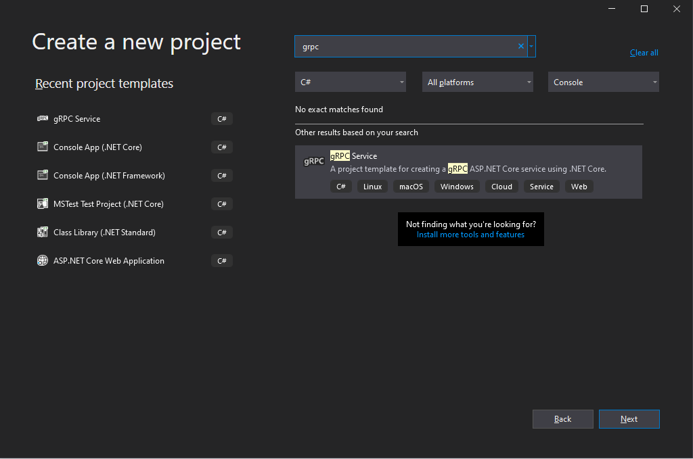

# Microsoft Telepathy Tutorial – Write your first SOA service and client

This series of tutorial introduces the SOA programming model for Microsoft Telepathy . This is the first tutorial of the series and provides guidance to write your first SOA service and client. 

## Getting started

Let's say we need a service running on the Telepathy cluster to echo the requests. Then we need a Telepathy client program to submit the echo requests to the service and returns the result to the end users. 

Here are the steps to write a SOA application in c#:

- Step 1: Define the proto

- Step 2: Implement the service

- Step 3: Deploy the service

- Step 4: Implement the client

- Step 5: Test the service

### Step 1: Define the proto

Following code can be found in the [sample protos](../samples/protos/).

A SOA service is a [gRPC](https://grpc.io/) service running on the Telepathy cluster. The SOA service is ideal for writing interactive, embarrassingly parallel applications, especially for calculation of complex algorithms.

The first step to run a Telepathy service is to define the proto file based on [Protocol Buffers](https://developers.google.com/protocol-buffers):
```protobuf
service Echo {
  rpc Echo (EchoRequest) returns (EchoReply);
}

message EchoRequest {
  string message = 1;
  int32 delayTime = 2;
  bytes dummydata = 3;
}

message EchoReply {
  string message = 1;
}
```
 The proto include message definition, gRPC service and method definition. Save the file with name `echo.proto`.

### Step 2: Implement the service

Following codes can be found in the [sample codes](../samples/csharp/). 

A SOA service does not require too much extra effort beyond your algorithm. It’s just a standard gRPC service. You can use **gRPC Service** project template in **Visual Studio 2019** with **ASP.NET and web development** to implement the cross-platform gRPC service. 
1. Start Visual Studio and select **Create a new project**. 
2. In the dialog, search "gRPC" and select **gRPC Service** option on the right and select **Next**:



3. Name the project **EchoServer** and select **Create**.
4. In the **Create a new gRPC service dialog**, select **Create**.
5. In the `EchoServer` project, expand `Protos` folder and replace the pre-created `greeter.proto` with `echo.proto` saved in Step1.
6. Expand `Services` folder and rename the file `GreeterService.cs` to `EchoService.cs`. Select `EchoService.cs`. Replace all the `GreeterService` to `EchoService` and `Greeter.GreeterBase` to `Echo.EchoBase`. Delete the `SayHello` method and implement your own `Echo` method which is defined in `echo.proto` with the following codes:

```csharp
public override async Task<EchoReply> Echo(EchoRequest request, ServerCallContext context)
        {
            await Task.Delay(request.DelayTime);
            return new EchoReply
            {
                Message = request.Message
            };
        }
```

7. Select `Startup.cs`. Replace the line `endpoints.MapGrpcService<EchoService>();` in `Configure` method to:

```csharp
endpoints.MapGrpcService<EchoService>();
```

8. Select `Program.cs`. Bind your service to **"TELEPATHY_SVC_PORT"** environment varibale defined port in `CreateHostBuilder` method.

```csharp
public static IHostBuilder CreateHostBuilder(string[] args) =>
            Host.CreateDefaultBuilder(args)
                .ConfigureWebHostDefaults(webBuilder =>
                {
                    webBuilder.UseStartup<Startup>();
                    // Add these two lines to read the port from environment variable.
                    var port = int.Parse(Environment.GetEnvironmentVariable("TELEPATHY_SVC_PORT"));
                    webBuilder.UseUrls($"http://0.0.0.0:{port}");
                });
```

You **must** read the port value from `TELEPATHY_SVC_PORT` environment variable and bind your service to that specific value so that tasks can be sent to your server successfully.

### Step 3: Deploy the service

After implementing your own `echo service`, we need to deploy the service to Telepathy cluster. Before we deploy the service, we need to create the service configuration file. Create an JSON file like the following:
```json
{
    "ServiceTimeout": 3000,
    "ServiceConcurrency": 1,
    "PrefetchCount": 10,
    "ServiceFullPath": "echo\\EchoServer.dll",
    "ServiceInitializeTimeout": 0,
    "ServiceLanguage": "csharp"
 }
```

The `"ServiceFullPath"` and "`ServiceLanguage`" **must** be filled and the others are optional parameters. Microsoft Telepathy now support **csharp**, **python** and **java** language which must be specified in "`ServiceLanguage`" parameter. If you use `Windows` operation system as the compute node, you can use both DLL file and EXE file while only DLL file is supported on `Linux` compute nodes. Note that the name of the JSON file must be as same as the service name, and must be lowercase. In this case, name it `echo.json`.

Now copy the service configuration file to the configuration blob container, which is a blob container named **service-registration** in the Azure Storage Account linked to your Telepathy cluster. Next step is to create a folder `echo` in **service-assembly** container in the same Storage Account, and copy the DLL file (and EXE file if you specify it in service configuration file.) into the folder. You can use tools like [Azure Storage Explorer](https://azure.microsoft.com/en-us/features/storage-explorer/) to access both two containers. 

### Step 4: Implement the client

### Step 5: Test the service